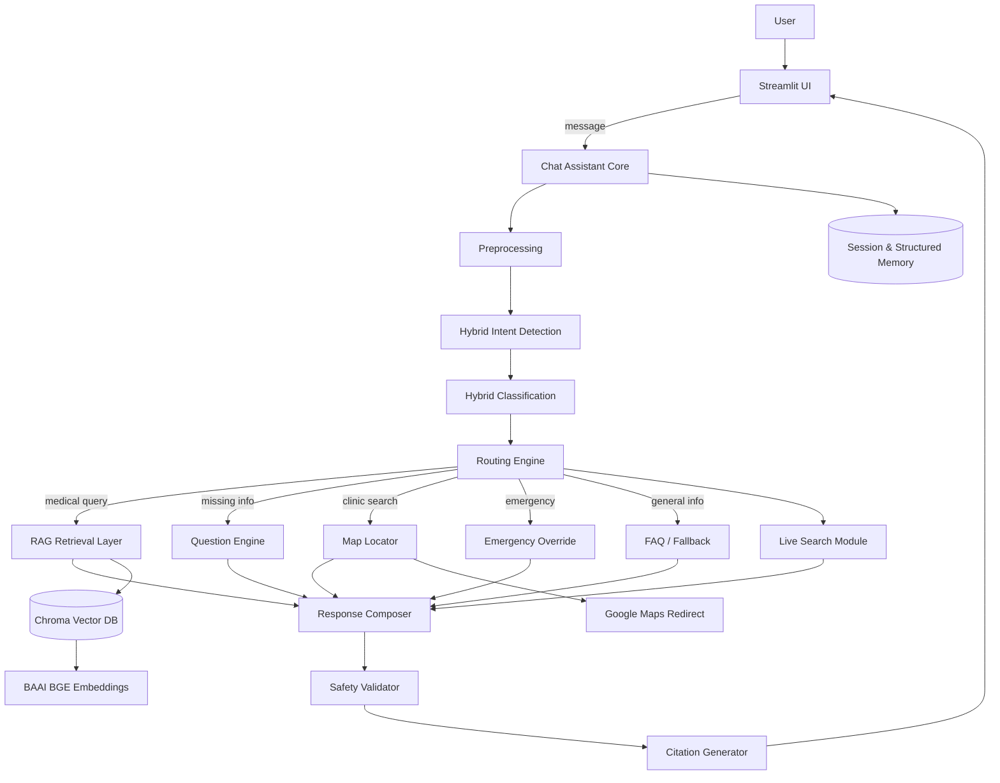
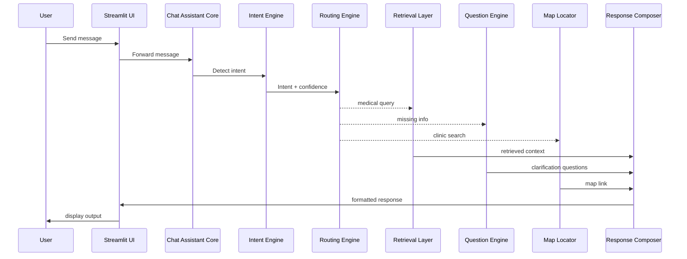
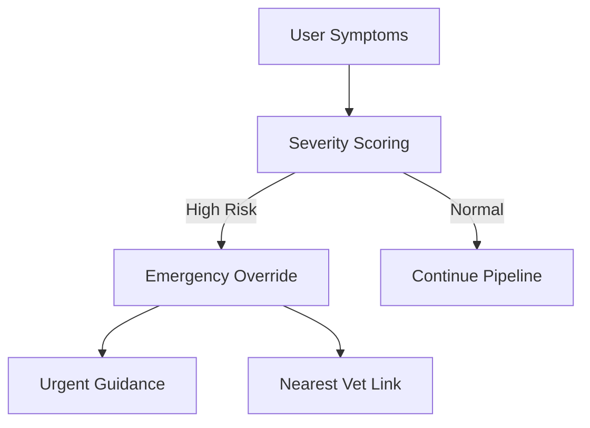

# Veterinary Chat Assistance System

## Core Architecture Documentation

This document defines the **core architectural design, technical flow, and implementation standards** for the Veterinary Chat Assistance chatbot. It is intended to guide development, ensure consistency, and support scalability and clinical safety.

---

# 1. System Objectives

## Primary Goals
- Provide safe, reliable veterinary guidance for pet owners.
- Assist users in identifying symptom severity.
- Guide users to nearby veterinary care when needed.
- Offer evidence-backed responses using a knowledge base.
- Maintain conversational continuity using hybrid memory.

## Design Principles
- Safety-first medical guidance
- Retrieval-grounded responses
- Modular & extensible architecture
- Controlled AI behavior
- Transparent citations
- Simple and clear user experience

---

# 2. Key Architectural Decisions

## Included
- Hybrid Intent Detection
- Hybrid Classification
- Hybrid Memory Architecture
- Knowledge Base + Live Search Retrieval
- Google Maps Redirect for clinic navigation
- Structured response generation

## Excluded
- Ad-hoc RAG ingestion (temporarily disabled)

---

# 3. Technology Stack

### Core
- **LLM**: Gemini
- **Orchestration**: LangChain
- **Vector Store**: ChromaDB
- **Embeddings**: BAAI BGE
- **Frontend**: Streamlit

### Supporting Modules
- Python backend services
- Google Maps redirect links
- Controlled live search module

---

# 4. Architecture Layers

## Architecture Diagram



### Diagram Notes
- The **Chat Assistant Core** orchestrates all routing and processing.
- The **Routing Engine** ensures modular flow control.
- Emergency override can interrupt the pipeline at any stage.
- Live search is only triggered when KB confidence is low.
- Memory is updated after each interaction.

---

## UI Separation Notice

⚠️ **Important Implementation Note**

The UI design and user interface styling are **NOT part of this core architecture**.

This architecture defines:
- backend processing
- AI orchestration
- retrieval logic
- safety and response generation

The UI must be developed as a **separate layer** that:
- consumes backend responses
- renders chat messages
- displays citations & map links
- maintains session state visually

This separation ensures:
✔ clean architecture boundaries  
✔ easier UI redesigns  
✔ multi-platform expansion (web/mobile)  
✔ independent frontend iteration  

---

## 4.1 Presentation Layer (UI)

### Components
- Streamlit chat interface
- Chat history container
- Citation panel
- Map redirect buttons

### Responsibilities
- Collect user input
- Display responses and citations
- Provide map navigation
- Maintain session UI state

⚠️ UI must not modify backend state directly.

---

## 4.2 Orchestration Layer (Chat Assistant Core)

### Components
- Message preprocessor
- Intent router
- Context manager
- Conversation controller

### Responsibilities
- Route messages to modules
- Maintain session context
- Enforces safety routing

---

## 4.3 Intelligence Layer

### Hybrid Intent Detection
Order of evaluation:
1. Rule-based triggers
2. Embedding similarity
3. LLM fallback classification

### Hybrid Classification
- Keyword routing
- Semantic similarity
- LLM ambiguity resolution

### Question Engine
- Detect missing context
- Ask clarifying questions

### Emergency Detection
- Severity keyword scoring
- Urgency escalation

---

## 4.4 Knowledge & Retrieval Layer

### Data Sources
- Veterinary care guidelines
- Symptom reference tables
- Vaccination schedules
- FAQ documents
- Clinic datasets

### Retrieval Flow
1. Query embedding
2. Vector similarity search (Chroma)
3. Metadata filtering
4. Top-K context retrieval

---

## 4.5 External Services Layer

### Live Search (Controlled)
Triggered only when:
- KB confidence below threshold
- Time-sensitive info required

### Map Locator
- Uses Google Maps redirect
- Generates search links based on user location

---

## 4.6 Response & Safety Layer

### Components
- Response composer
- Safety validator
- Citation generator
- Hallucinaton guard

### Responsibilities
- Generate structured responses
- Highlight emergency warnings
- Attach knowledge citations

---

## 4.7 Memory Layer

### Session Memory
Stores:
- conversation history
- last intent
- symptom progression

### Structured Memory
Stores:
- pet type
- age
- medical notes

### Retrieval Memory
- cached context
- recent semantic matches

---

# 5. New Chat Session Flow

## Initialization Steps
1. Generate session ID
2. Initialize session memory
3. Load vector DB & models
4. Load intent rules & classification schema
5. Initialize UI state

---

# 6. Message Processing Pipeline

## Step 1: Preprocessing
- Normalize text
- Remove noise
- Tokenize

## Step 2: Intent Detection
Rule → Vector → LLM fallback

## Step 3: Context Injection
- conversation history
- pet profile
- last intent

## Step 4: Routing Decision

### Medical Query
→ KB retrieval → response generation

### Incomplete Info
→ question engine

### Clinic Locator
→ map module

### Emergency
→ emergency override

### General Info
→ FAQ / fallback

---

# 7. Emergency Override Flow

If severe symptoms detected:
- Interrupt normal pipeline
- Provide urgent guidance
- Display nearest clinic link

---

# 8. Live Search Flow

Triggered when KB insufficient.

1. Fetch trusted sources
2. Extract key guidance
3. Summari"ze for user
4. Label as latest guidance

---

# 9. Response Structure Standard

Responses must follow:

1. Direct answer
2. Possible causes
3. Warning signs
4. When to visit vet
5. Care tips (optional)

---

# 10. Citation Standards

Responses using KB or live search must include:
- source name
- organization
- publication year (if available)

---

# 11. Map Locator Flow

1. Detect location intent
2. Obtain user location
3. Generate Google Maps search URL
4. Display navigation link

---

# 12. Safety Guardrails

The system must NOT:
- provide medication dosages
- claim definitive diagnosis
- replace professional veterinary care

The system MUST:
- highlight emergency signs
- recommend veterinary consultation when needed

---

# 13. Scalability & Future Enhancements

## Planned Enhancements
- Multi-language support
- User pet profile storage
- Appointment booking integration
- Offline clinic database sync
- Analytics & usage monitoring

---

# 14. Development Guidelines

## Code Structure
- modular services
- stateless processing where possible
- strict separation of UI & logic

## Testing Requirements
- intent routing accuracy
- emergency detection reliability
- hallucination prevention

---

# 15. Summary

This architecture ensures:

✔ Safe veterinary guidance  
✔ Accurate retrieval-grounded responses  
✔ Modular scalability  
✔ Controlled AI decision-making  
✔ Clear user experience  

---

---

# 16. Dynamic Workflows & Sequence Diagrams

## 16.1 End-to-End Message Flow (Runtime)



## 16.2 Emergency Override Flow



---

# 17. Prompt Orchestration Layer

## Purpose
Ensure consistent AI behavior across modules.

### Prompt Types Used
- Master System Prompt (global behavior)
- RAG Response Prompt
- Clarification Question Prompt
- Emergency Response Prompt
- Live Search Summary Prompt
- Citation Formatter Prompt
- FFallback Response Prompt

## Prompt Routing Logic

| Scenario | Prompt Used |
|----------|------------|
KB answer | RAG prompt |
Missing info | Question prompt |
Emergency | Emergency prompt |
Live updates | Live search prompt |
General info | Fallback prompt |

⚠️ All prompts inherit safety & tone rules from the master prompt.

---

# 18. Runtime State Model

## Session State Object

```
session_state = {
  session_id,
  conversation_history,
  last_intent,
  pet_profile,
  severity_flag,
  retrieved_context,
  last_response_sources
}
```

## State Update Cycle
1. After each user message
2. After retrieval
3. After response generation

---

# 19. Data & Metadata Schema (Retrieval Layer)

## Vector Document Metadata

```
{
  "species": "dog/cat/etc",
  "category": "symptom | vaccination | disease",
  "severity": "low | moderate | high",
  "emergency_flag": true/false,
  "source": "WSAVA Guidelines",
  "year": 2024
}
```

## Clinic Dataset Fields

- clinic_name
- latitude
- longitude
- address
- phone
- open_hours

---

# 20. Hybrid Intent & Classification Logic

## Detection Order
1. Rule-based triggers
2. Embedding similarity matching
3. LLM classification fallback

## Intent Confidence Strategy

- High → route immediately
- Medium → confirm via context
- Low → ask clarification

---

# 21. Live Search Control Logic

## Trigger Conditions
Live search is allowed ONLY when:
- KB confidence below threshold
- User requests latest guidance
- Region-specific regulations

## Safety Filtering
- trusted veterinary organizations
- peer-reviewed sources
- official advisories

---

# 22. Emergency Detection Specification

## High-Risk Keywords
- seizure
- poisoning
- collapse
- uncontrolled bleeding
- difficulty breathing

## Severity Scoring
- keyword weight
- symptom combinations
- duration indicators

Threshold breach activates emergency override.

---

# 23. Hybrid Memory Architecture (Deep Dive)

## Session Memory
Maintains conversational continuity.

## Structured Memory
Stores:
- pet species
- age
- known conditions

## Retrieval Memory
Caches:
- recent relevant KB chunks
- previous semantic matches

---

# 24. Module Contracts & I/O

## Intent Engine
**Input:** user message  
**Output:** intent label + confidence

## Retrieval Layer
**Input:** query embedding  
**Output:** relevant knowledge chunks

## Response Composer
**Input:** context + intent  
**Output:** structured response

## Map Locator
**Input:** location data  
**Output:** Google Maps URL

---

# 25. Non-Functional Requirements

## Performance
- response latency < 3 seconds
- retrieval latency < 500 ms

## Reliability
- emergency detection priority routing
- graceful fallback if services fail

## Safety
- hallucination minimization
- medical safety guardrails

## Scalability
- modular services
- replaceable LLM provider

---

# 26. New Chat Session Expectations

When a new session begins, the system expects:

✔ symptom queries  
✔ clinic location requests  
✔ pet care questions  
✔ vaccination schedules  
✔ follow-up clarifications  

The system must guide unclear inputs using the question engine.

---

# 27. Architecture Summary

This architecture integrates:

✔ dynamic routing workflows  
✔ hybrid AI decision systems  
✔ retrieval-grounded responses  
✔ safety-first veterinary guidance  
✔ modular scalability  
✔ controlled live information retrieval  

---

**End of Core Architecture Document**


