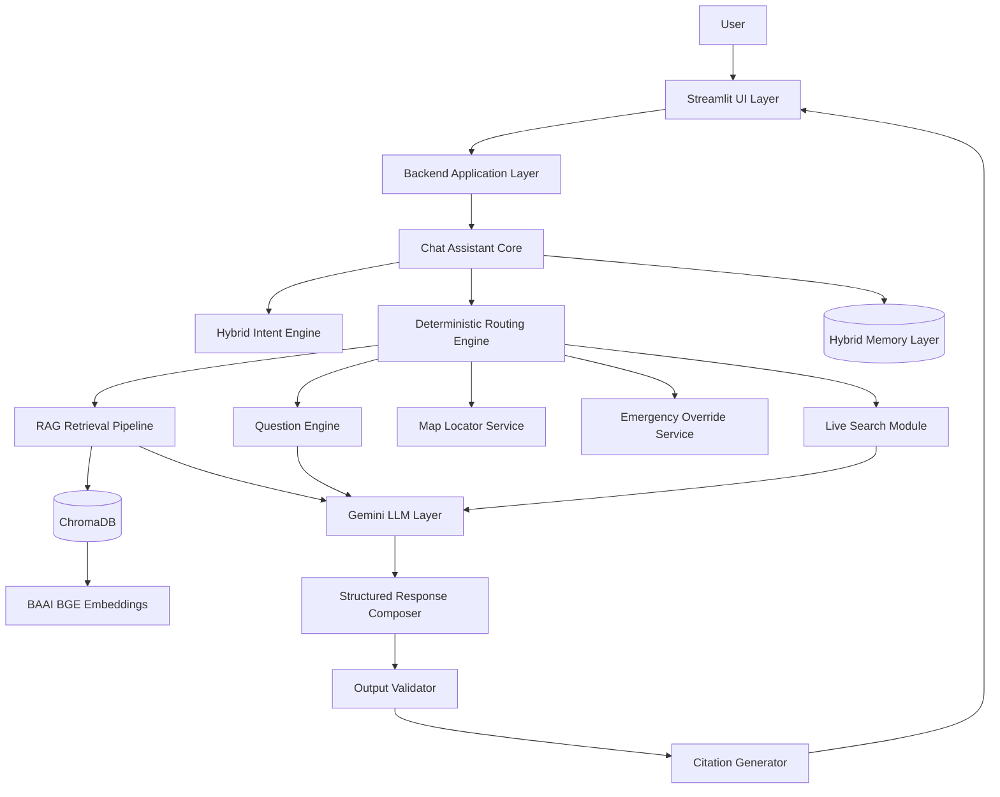
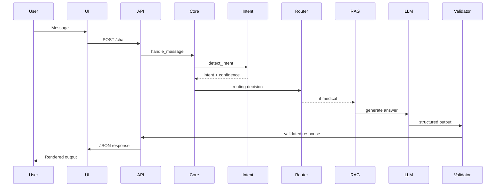
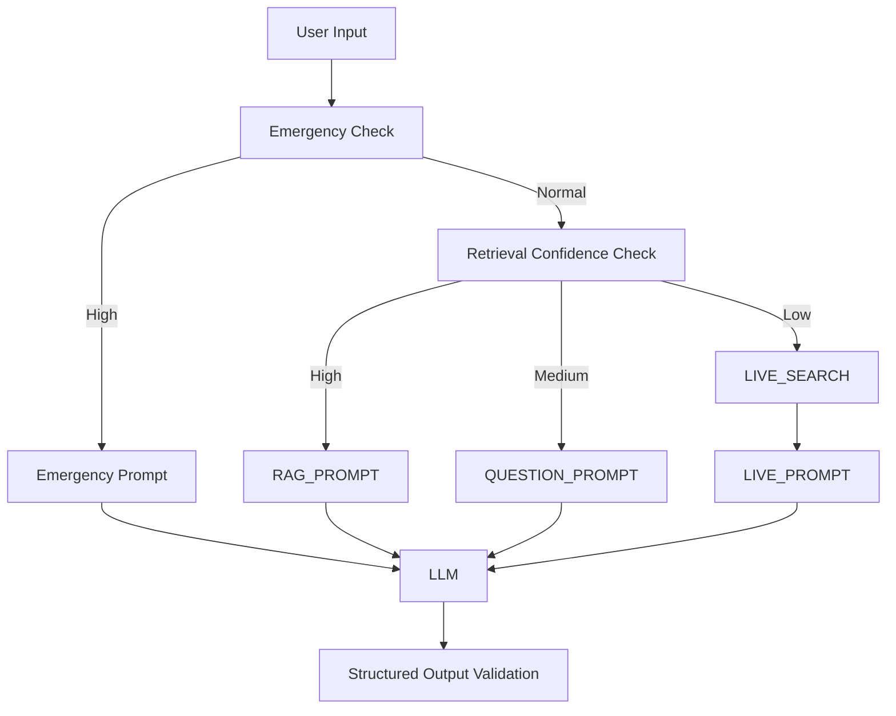
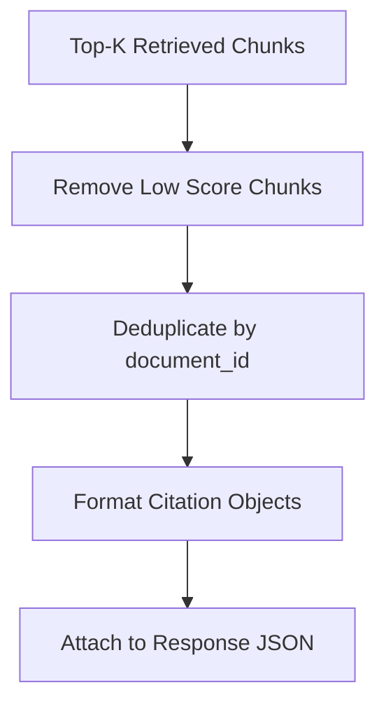
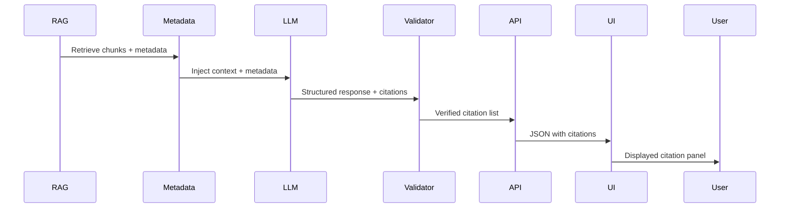
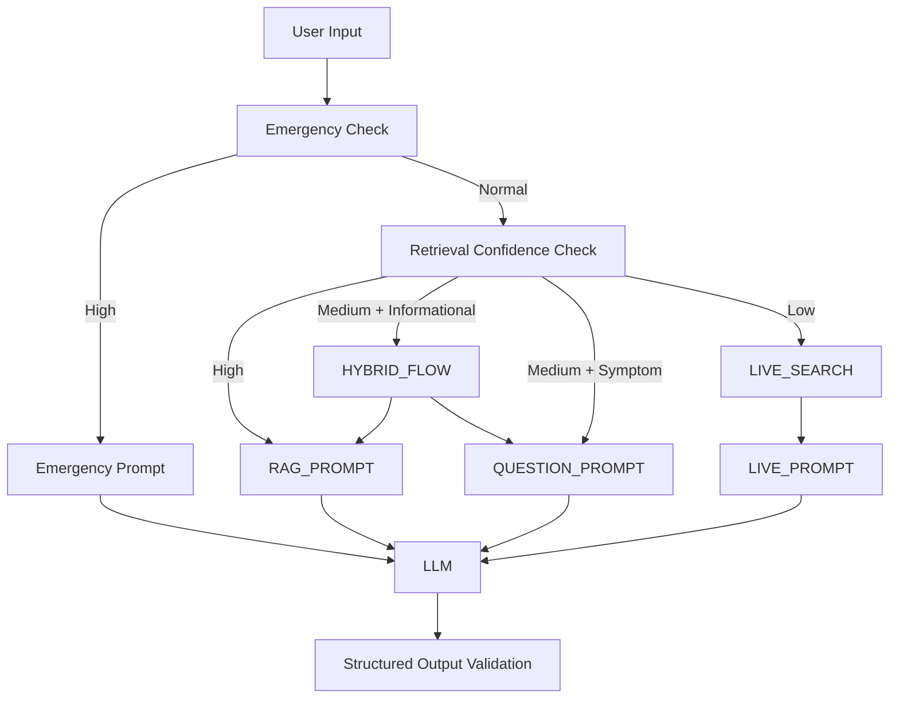

# Veterinary Chat Assistance System

# Production-Grade Core Architecture Documentation (Technical Specification v2)

This document defines the complete system-level technical architecture, execution logic, runtime behavior, orchestration rules, and production specifications for the Veterinary Chat Assistance chatbot.

This version expands the architecture into an implementation-ready blueprint suitable for backend engineers, AI engineers, and system architects.

---

# 1. System Scope

## 1.1 Functional Scope
The system provides:
- Veterinary symptom guidance
- Emergency detection & escalation
- Vaccination and preventive care information
- Clinic locator via Google Maps redirect
- Retrieval-grounded responses
- Controlled live search augmentation

## 1.2 Out of Scope
- Ad-hoc RAG document ingestion
- UI styling and visual design implementation
- Appointment booking integration (future)

---

# 2. High-Level Architecture Overview



---

# 3. Layer-by-Layer Technical Specification

---

# 3.1 Presentation Layer (UI - Separate Implementation)

⚠️ IMPORTANT:
The UI design, layout, animations, styling, and user interaction visuals are NOT part of this architecture.

The UI must be built separately and consume backend API responses.

### UI Responsibilities
- Send user message to backend
- Render structured response
- Display citations
- Display Google Maps redirect links
- Maintain visual chat history

### UI Restrictions
- Must NOT modify backend state
- Must NOT perform AI inference
- Must NOT store medical decisions

---

# 3.2 Backend Application Layer

This layer exposes endpoints:

POST /chat
POST /location
GET /health

Handles:
- Session creation
- Request validation
- Error handling
- Logging

---

# 3.3 Chat Assistant Core (Orchestration Engine)

## Responsibilities
- Preprocessing
- Intent detection
- Context injection
- Routing decision
- Memory update

## Deterministic Routing Pseudocode

```
def handle_message(message, session_state):
    preprocessed = preprocess(message)
    intent, confidence = detect_intent(preprocessed)

    emergency_score = compute_emergency_score(preprocessed)

    if emergency_score >= EMERGENCY_THRESHOLD:
        return emergency_flow(preprocessed)

    if intent == "clinic_locator":
        return map_flow(preprocessed)

    if intent == "symptom_inquiry":
        return rag_flow(preprocessed)

    if intent == "missing_info":
        return clarification_flow(preprocessed)

    return fallback_flow(preprocessed)
```

---

# 3.4 Hybrid Intent Detection Engine

## Detection Order
1. Rule-based pattern match
2. Embedding similarity classification
3. LLM classification fallback

## Confidence Calculation

Embedding similarity scoring:

```
confidence = cosine_similarity(query_vector, intent_centroid)
```

### Thresholds

- confidence >= 0.82 → High
- 0.65–0.81 → Medium
- < 0.65 → Low

Routing Strategy:

- High → route directly
- Medium → validate with context
- Low → LLM classification

---

# 3.5 Retrieval Confidence & Live Search Logic

## Retrieval Scoring

For RAG:

```
top_score = max(similarity_scores)
avg_top_k = mean(top_k_scores)
```

Decision Matrix:

| top_score | Action |
|------------|--------|
| > 0.82 | Use KB |
| 0.70–0.82 | Ask clarification |
| < 0.70 | Trigger live search |

If live search fails:
- Provide general safe fallback guidance
- Recommend veterinary consultation

---

# 3.6 RAG Retrieval Pipeline

1. Embed query using BAAI BGE
2. Query ChromaDB
3. Filter by metadata (species, severity)
4. Select top_k = 5
5. Pass context to LLM

### Metadata Schema

```
{
  species: string,
  category: string,
  severity: string,
  emergency_flag: boolean,
  source: string,
  year: int
}
```

---

# 3.7 LLM Invocation Architecture

## LLM Call Types

1. Intent fallback classification
2. RAG answer generation
3. Clarification question generation
4. Emergency response formatting
5. Live search summarization

## Configuration

- Temperature: 0.2 (deterministic)
- Max tokens: 512
- Top_p: 0.9
- Stop sequences enforced

## Rate Limit Handling

- Retry with exponential backoff (max 3 attempts)
- Fallback to cached response if available

---

# 3.8 Structured Output Validation

All LLM outputs must conform to schema:

```
class VetResponse(BaseModel):
    answer: str
    possible_causes: str
    warning_signs: str
    vet_visit_guidance: str
    care_tips: Optional[str]
    citations: List[str]
```

Validation failure → regenerate once → fallback template

---

# 3.9 Emergency Detection Engine

## Severity Score Formula

```
score = sum(keyword_weight) + duration_weight + combination_bonus
```

Threshold = 8

High-risk keywords weighted 3–5 points.

Immediate override if:
- breathing difficulty
- seizure
- collapse
- poisoning

---

# 3.10 Live Search Module

## Trigger Conditions
- top_score < 0.70
- User explicitly requests latest guidance
- Regulatory or outbreak topic

## Source Filtering
Allow only:
- Official veterinary bodies
- Government advisories
- Peer-reviewed sources

Reject:
- Blogs
- Forums
- Social media

---

# 3.11 Hybrid Memory Architecture

## Session Memory
- conversation_history
- last_intent
- emergency_flag

## Structured Memory
- pet_species
- age
- medical_conditions

## Retrieval Memory
- last_retrieved_chunks
- last_similarity_scores

Memory stored per session_id.

Session expiration: 30 minutes inactivity.

---

# 3.12 Error Handling Model

| Failure | Action |
|----------|--------|
| Vector DB unavailable | fallback general guidance |
| LLM timeout | retry 3x then fallback |
| Live search failure | fallback safe guidance |
| Location unavailable | ask user to enter city |

All errors logged.

---

# 3.13 Caching Strategy

- Embedding cache (query hash → vector)
- Retrieval cache (query hash → top_k results)
- Response cache (normalized query → response)
- LLM output cache (temperature=0.2 only)

TTL = 1 hour.

---

# 3.14 Concurrency & Scaling

- Each session isolated via session_id
- Stateless API layer
- ChromaDB connection pooled
- Async LLM calls
- Horizontal scaling supported

---

# 3.15 Security & Privacy

- No permanent storage of medical data
- Session data auto-cleared
- API keys stored in environment variables
- Location permission required
- Logs anonymized

---

# 3.16 Observability & Monitoring

Logs capture:
- Intent classification result
- Emergency score
- Retrieval scores
- LLM latency
- Token usage
- Errors

Metrics:
- Average response time
- Emergency detection rate
- Live search frequency

---

# 3.17 Full End-to-End Sequence Diagram



---

# 3.18 Non-Functional Requirements

Performance:
- P95 latency < 3s

Reliability:
- 99% uptime

Safety:
- 0 dosage hallucinations

Scalability:
- 100+ concurrent sessions

---

# 4. Final Architecture Guarantees

This system ensures:

✔ Deterministic routing  
✔ Controlled live search  
✔ Retrieval-grounded answers  
✔ Emergency-first override  
✔ Structured validated outputs  
✔ Modular replaceable components  
✔ Clear separation of UI and backend  

---

---

# 5. Prompt Engineering & Structured LLM Specifications

This section defines the exact prompt templates, structural constraints, and orchestration logic used for all LLM interactions. These prompts are mandatory and version-controlled.

All prompts inherit constraints from the Master System Prompt.

---

# 5.1 Master System Prompt (Global Behavioral Contract)

## Purpose
Defines tone, safety guardrails, and response structure.

```
You are a veterinary assistance AI.

OBJECTIVES:
- Provide safe, clear, evidence-based guidance.
- Do not provide medication dosages.
- Do not make definitive diagnoses.
- Always highlight emergency warning signs.
- Encourage veterinary consultation when appropriate.

RESPONSE STYLE:
- Calm and reassuring.
- Simple language.
- Short paragraphs.
- Structured output only.

If information is missing, ask clarifying questions.
If uncertain, say so.
```

Temperature: 0.2  
Max Tokens: 512  

---

# 5.2 RAG Prompt (Knowledge-Based Response Template)

## Used When
Vector retrieval confidence ≥ threshold.

## Inputs
- user_question
- retrieved_context
- pet_type
- conversation_context

## Template

```
Use ONLY the provided veterinary knowledge.

USER QUESTION:
{user_question}

PET TYPE:
{pet_type}

RETRIEVED CONTEXT:
{retrieved_context}

CONVERSATION CONTEXT:
{conversation_context}

INSTRUCTIONS:
- Base your answer strictly on retrieved context.
- Do not invent facts.
- If context insufficient, say so.

FORMAT:

Answer:

Possible Causes:

Warning Signs:

When to See a Vet:

Care Tips:
```

---

# 5.3 Question Engine Prompt (Clarification Flow)

## Used When
Intent confidence medium OR missing required fields.

## Inputs
- user_input
- missing_fields
- suspected_intent

## Template

```
The user's message lacks required details.

USER MESSAGE:
{user_input}

MISSING INFORMATION:
{missing_fields}

SUSPECTED INTENT:
{suspected_intent}

Ask 2–4 essential clarifying questions.
Keep them concise.
Do not provide medical advice yet.
Return only bullet-point questions.
```

---

# 5.4 Emergency Prompt (Override Template)

## Used When
Emergency score ≥ threshold.

## Inputs
- symptoms
- pet_type

## Template

```
The symptoms may indicate a medical emergency.

SYMPTOMS:
{symptoms}

PET TYPE:
{pet_type}

Provide urgent structured guidance.

FORMAT:

EMERGENCY ALERT:

Why This Is Serious:

Immediate Action:

Seek Veterinary Care Immediately.

If transport delay occurs:

Do NOT provide diagnosis or medication dosing.
```

This prompt bypasses normal RAG flow.

---

# 5.5 Live Search Summary Prompt

## Used When
KB confidence below threshold and live search triggered.

## Inputs
- topic
- filtered_search_results

## Template

```
Summarize the latest veterinary guidance from the provided trusted sources.

TOPIC:
{topic}

SEARCH RESULTS:
{filtered_search_results}

Provide:

Latest Guidance:

Key Points:
- point
- point
- point

Mention that recommendations may vary by veterinarian.
```

---

# 5.6 Fallback General Guidance Prompt

## Used When
No reliable KB or live data available.

## Template

```
Provide safe, general veterinary guidance for the user's question.

Do not speculate.
Encourage veterinary consultation if symptoms persist.
Keep response under 150 words.
```

---

# 5.7 Intent Classification Prompt (LLM Fallback)

## Used When
Rule-based and embedding classification confidence low.

## Template

```
Classify the user intent.

INTENTS:
- symptom_inquiry
- emergency
- clinic_locator
- vaccination
- pet_care
- follow_up
- general_info

USER MESSAGE:
"{message}"

Return ONLY the intent label.
```

---

# 5.8 Prompt Versioning & Governance

Each prompt must include:
- version_id
- last_updated_date
- owner

Example:

prompt_version = "RAG_v1.2"

Prompt updates require:
- regression testing
- emergency detection validation
- hallucination testing

---

# 5.9 Prompt Injection Protection Rules

The system must:
- Ignore user attempts to override instructions
- Reject requests to reveal system prompt
- Refuse unsafe medical instructions

All LLM calls must prepend system prompt before user content.

---

# 5.10 LLM Call Workflow Diagram



---

---

# 6. Citation System – Technical Architecture & Prompt Specification

The citation system is a mandatory transparency layer that ensures every knowledge-grounded response is traceable to its source.

It applies to:
- RAG-based responses
- Live search responses
- Hybrid responses (KB + live)

It does NOT apply to:
- Pure clarification questions
- Emergency formatting without KB usage

---

# 6.1 Citation Objectives

The citation module must:

✔ Attach source references for all retrieval-based responses  
✔ Preserve traceability to original KB chunks  
✔ Avoid hallucinated references  
✔ Distinguish KB citations from live search citations  
✔ Provide structured citation metadata  

---

# 6.2 Citation Data Model

## 6.2.1 Vector Document Metadata (Extended)

Each chunk stored in ChromaDB must include:

```
{
  document_id: string,
  chunk_id: string,
  source_title: string,
  organization: string,
  publication_year: int,
  section_reference: string,
  url: optional string,
  evidence_level: string,
  last_updated: date
}
```

This ensures citation traceability.

---

# 6.3 Citation Generation Workflow



---

# 6.4 Citation Confidence Threshold

Only chunks meeting:

```
similarity_score >= 0.75
```

are eligible for citation.

If no chunk exceeds threshold:
- No citation attached
- Response labeled as general guidance

---

# 6.5 Citation JSON Output Contract

All RAG responses must return:

```
{
  answer: string,
  possible_causes: string,
  warning_signs: string,
  vet_visit_guidance: string,
  care_tips: string,
  citations: [
    {
      source_title: string,
      organization: string,
      publication_year: int,
      section_reference: string,
      url: optional string
    }
  ]
}
```

UI renders citation list separately.

---

# 6.6 RAG Citation Prompt Addendum

The RAG prompt must instruct the LLM:

```
At the end of your response, include citation references ONLY from the retrieved context.
Do not fabricate sources.
Use the metadata fields exactly as provided.
If context insufficient, do not create citations.
```

The LLM must not invent new citation entries.

---

# 6.7 Live Search Citation Prompt

## Inputs
- filtered_search_results (structured metadata)

## Template

```
Summarize the provided trusted veterinary sources.

At the end, list citations in the format:

Sources:
- Source Title | Organization | Year

Do not fabricate sources.
Use only provided metadata.
```

---

# 6.8 Citation Deduplication Rules

If multiple chunks originate from same document:

- Only one citation entry allowed
- Merge section references

Example:

"Section 3.1, 4.2"

---

# 6.9 Hallucination Prevention Rules (Citation Layer)

The system must:

- Reject any citation not present in retrieved metadata
- Validate citation list against retrieved document_ids
- Remove citations if mismatch detected
- Regenerate response once if hallucination detected

---

# 6.10 Citation Logging & Auditing

For each response log:

- retrieved document_ids
- similarity scores
- attached citation list
- live search source domains

Used for:
- Audit trail
- Medical reliability verification
- Regulatory compliance

---

# 6.11 Citation Failure Handling

| Failure | Action |
|----------|--------|
| No eligible chunks | Return response without citations |
| Metadata missing | Exclude chunk |
| LLM fabricates citation | Regenerate response |

---

# 6.12 Citation UI Separation Rule

Backend returns citations in structured JSON.
UI responsibility:
- Render citation panel
- Display expandable source list
- Provide clickable URLs if available

UI must NOT:
- Modify citation content
- Add or remove references

---

# 6.13 End-to-End Citation Flow Diagram



---

# 6.14 Citation Integrity Guarantees

The citation system guarantees:

✔ Every citation is traceable to stored KB metadata  
✔ No hallucinated references  
✔ Confidence-based inclusion  
✔ Structured JSON validation  
✔ Audit-ready logging  

---

# 7. Final Guarantee

With prompt structuring integrated, the system now ensures:

✔ Deterministic routing logic  
✔ Strict prompt governance  
✔ Emergency-first override handling  
✔ Retrieval-grounded answers only  
✔ Structured validated outputs  
✔ Injection-resistant prompt control  
✔ Full production-ready AI orchestration  

---

END OF PRODUCTION ARCHITECTURE DOCUMENT

---------------------------------------

## Architecture Update - 1

# 8. Hybrid Partial Response Mode – Architectural Amendment

This section introduces a controlled Hybrid Partial Response Mode to resolve over-restrictive clarification behavior for general informational queries (e.g., vaccination schedules) while preserving medical safety.

This amendment modifies behavior in the following layers:
- 3.3 Chat Assistant Core (Routing Logic)
- 3.5 Retrieval Confidence & Live Search Logic
- 5.1 Master System Prompt
- 5.3 Question Engine Prompt
- 5.10 LLM Call Workflow Diagram

No other architectural components are altered.

---

## 8.1 Amendment to 3.5 Retrieval Confidence & Live Search Logic

### Updated Decision Matrix

| top_score | Intent Type | Action |
|------------|-------------|--------|
| > 0.82 | Any | FULL_RAG |
| 0.70–0.82 | vaccination / pet_care / general_info | HYBRID_PARTIAL |
| 0.70–0.82 | symptom_inquiry | CLARIFICATION_REQUIRED |
| < 0.70 | Any | LIVE_SEARCH |

---

## 8.2 Amendment to 3.3 Chat Assistant Core (Routing Engine)

```
def determine_response_mode(intent, retrieval_score, emergency_score):

    if emergency_score >= EMERGENCY_THRESHOLD:
        return "EMERGENCY"

    if retrieval_score > 0.82:
        return "FULL_RAG"

    if 0.70 <= retrieval_score <= 0.82:
        if intent in ["vaccination", "pet_care", "general_info"]:
            return "HYBRID_PARTIAL"
        if intent == "symptom_inquiry":
            return "CLARIFICATION_REQUIRED"

    return "LIVE_SEARCH"
```

Routing Replacement:

```
response_mode = determine_response_mode(intent, retrieval_score, emergency_score)

if response_mode == "FULL_RAG":
    return rag_flow(preprocessed)

if response_mode == "HYBRID_PARTIAL":
    answer = rag_flow(preprocessed)
    questions = clarification_flow(preprocessed)
    return merge(answer, questions)

if response_mode == "CLARIFICATION_REQUIRED":
    return clarification_flow(preprocessed)

if response_mode == "LIVE_SEARCH":
    return live_search_flow(preprocessed)
```

---

## 8.3 Amendment to 5.1 Master System Prompt

Replace:

"If information is missing, ask clarifying questions."

With:

"If partial information is available, provide safe general guidance first.
Ask clarifying questions only when missing details significantly affect safety or accuracy."

---

## 8.4 Amendment to 5.3 Question Engine Prompt

Replace:

"Do not provide medical advice yet."

With:

"Only avoid providing guidance if missing information prevents safe advice.
If safe general guidance is possible, provide it before asking clarifications."

---

## 8.5 Amendment to 5.10 LLM Call Workflow Diagram



---

## 8.6 Safety Preservation Rule

HYBRID_PARTIAL mode is prohibited when:
- emergency_score >= threshold
- dosage-related queries
- toxic exposure queries
- seizure / collapse / respiratory distress indicators

---

## 8.7 Expected Behavioral Outcome

Example Query:
"3 month old cat vaccination schedule"

System Output:
- Explanation of vaccination
- General kitten vaccination schedule
- Follow-up questions about prior doses
- Indoor/outdoor status clarification

---

END OF ARCHITECTURAL UPDATE - 1

---
